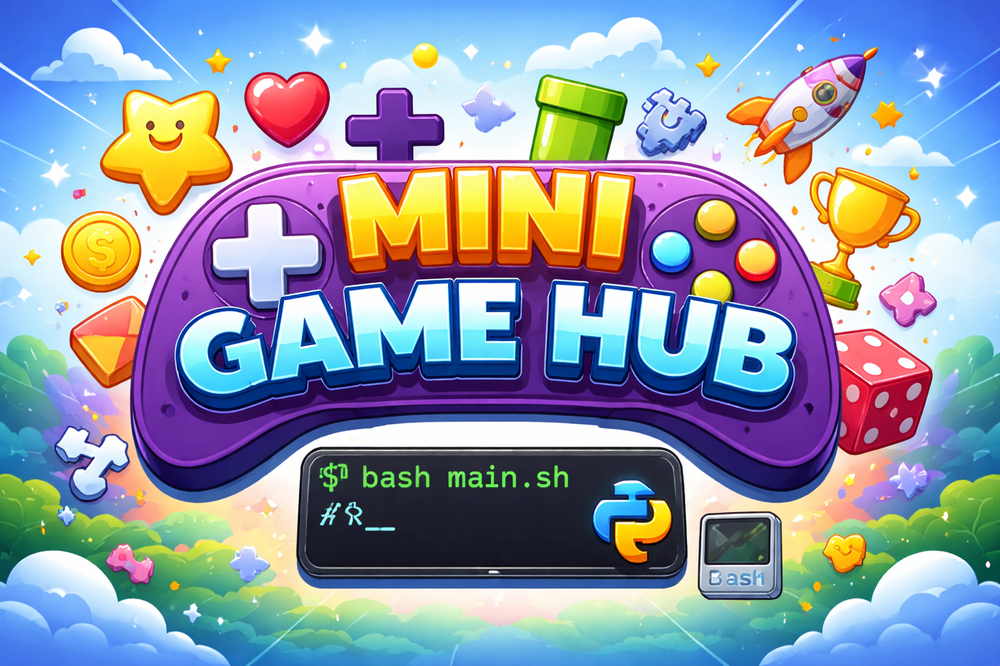

<p align="center">
  
  </p>

# 🎮 Mini Game Hub

A modular, command-line driven mini game platform built using **Bash** and **Python (Pygame)**.
This project demonstrates clean system design, user authentication, and interactive gameplay in a structured and scalable way.

---

## 🚀 Overview

Mini Game Hub is designed as a lightweight gaming platform where two users must authenticate before accessing the game engine. The system separates concerns across multiple components, ensuring maintainability and clarity.

---
<p align="center">
  
</p>

## ✨ Features

* 🔐 **User Authentication System**

  * Login / Signup functionality
  * Secure password storage using **SHA-256 hashing**
  * No plaintext password storage

* 👥 **Two-Player System**

  * Ensures both players are authenticated before gameplay
  * Prevents duplicate or invalid users

* 🧩 **Modular Architecture**

  * Clear separation between control flow, authentication, and game logic
  * Easy to extend and maintain

* 🎮 **Game Engine (Pygame)**

  * Interactive window-based gameplay
  * Scalable for adding multiple games

* 🔁 **Robust Control Flow**

  * Input validation loops
  * Error handling for incorrect credentials

---

## 🛠️ Tech Stack

* **Bash** → User interaction & control flow
* **Python** → Core logic & authentication
* **Pygame** → Game engine & UI

---

## 📁 Project Structure

```
Mini-Game-Hub/
│
├── main.sh        # Entry point (handles user input & flow)
├── auth.py        # Authentication logic (login/signup, hashing)
├── game.py        # Game engine (Pygame)
├── users.tsv      # User database (hashed passwords)
└── README.md
```

---

## ▶️ How to Run

### 1. Clone the repository

```
git clone https://github.com/pravarkumar/mini-game-hub.git
cd Mini-Game-Hub
```

### 2. Make script executable

```
chmod +x main.sh
```

### 3. Run the project

```
bash main.sh
```

---

## 🔐 Authentication Flow

1. User selects login or signup
2. Username and password are entered
3. Password is hashed using **SHA-256**
4. Credentials are verified against `users.tsv`
5. If valid → authentication success
6. If invalid → user is prompted again

> This ensures basic security and avoids storing sensitive data in plaintext.

---

## 🎮 Game Flow

1. Player 1 authentication
2. Player 2 authentication
3. Game launches via `game.py`
4. Players interact through Pygame window

---

## 🔮 Improvements with time 

* 🏆 Leaderboard system
* 🎲 Multiple games (TicTacToe, Snake, etc.)
* 🎨 Improved UI/UX
* 🔒 Stronger authentication (salting, encryption)
* 🌐 Multiplayer/network support

---

## 💡 Design Philosophy

This project emphasizes:

* Separation of concerns
* Clean and readable structure
* Using the right tool for the right task
* Fun and smooth activity for both the users
* Multiple games for both the users to choose from.

---

## 📌 Author

* Pravar Kumar 
* Shantanu Patil 

---

## ⭐ Final Note

This project is not just a game — it is a demonstration of **system design, security fundamentals, and modular programming** in a beginner-friendly yet scalable architecture.It is a fun game project created by us as an escape to from the everyday boredom.
So plz enjoy :)

---


