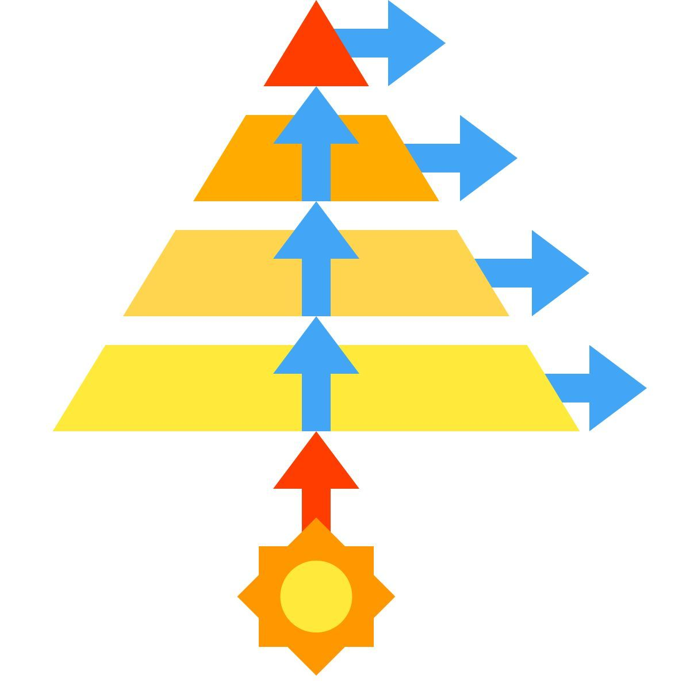

<p align="center">
  
</p>

<h1 align="center">🎮 Mini Game Hub</h1>
<p align="center"><i>A modular, command-line driven mini game platform built using Bash & Python (Pygame)</i></p>
<!-- Itallic for esthatic :) -->
---

## 🚀 Overview

<p align="center">
  
</p>

<table align="center">
<tr>
<td align="center">🎯 <b>Purpose</b><br>Lightweight 2-player gaming platform</td>
<td align="center">🧠 <b>Concept</b><br>Modular & clean architecture</td>
<td align="center">⚡ <b>Experience</b><br>Fast & interactive gameplay</td>
</tr>
</table>

---

## ✨ Features

<table align="center">
<tr>

<td align="center" width="20%">
<br>
<b>Authentication</b>
</td>

<td align="center" width="20%">
<br>
<b>Two Players</b>
</td>

<td align="center" width="20%">
<br>
<b>Modular</b>
</td>

<td align="center" width="20%">
<br>
<b>Game Engine</b>
</td>

<td align="center" width="20%">
<br>
<b>Control Flow</b>
</td>

</tr>

<tr>

<td align="center">
Login / Signup<br>SHA-256 hashing
</td>

<td align="center">
2-player auth<br>No duplicates
</td>

<td align="center">
Clean structure<br>Easy scaling
</td>

<td align="center">
Pygame UI<br>Interactive play
</td>

<td align="center">
Validation<br>Error handling
</td>

</tr>
</table>

---

## 🛠️ Tech Stack
<!-- These are all the main pilars of our projects the major domains used in the project -->
<p align="center">
  <br><br>
  
</p>

<p align="center"><b>Pygame Game Engine</b></p>

---

## ▶️ How to Run

<table align="center">
<tr>

<td align="center">
<br>
<b>Clone</b>
</td>

<td align="center">
<br>
<b>Permissions</b>
</td>

<td align="center">
<br>
<b>Run</b>
</td>

</tr>

<tr>

<td>

```bash
git clone https://github.com/pravarkumar/mini-game-hub.git
cd Mini-Game-Hub
```

</td>

<td>

```bash
chmod +x main.sh
```

</td>

<td>

```bash
bash main.sh
```

</td>

</tr>
</table>

---

## 🔐 Authentication Flow

<table align="center">
<tr>
<!-- tried using absolute paths for easy access-->
<td align="center">
<br>
Login
</td>

<td align="center">
<br>
Credentials
</td>

<td align="center">
<br>
Hashing
</td>

<td align="center">
<br>
Verify
</td>

<td align="center">
<br>
Success
</td>

<td align="center">
<br>
Retry
</td>

</tr>

<tr>
<td>User selects</td>
<td>Enter details</td>
<td>Encrypt password</td>
<td>Check database</td>
<td>Access granted</td>
<td>Try again</td>
</tr>
</table>

---

## 🎮 Game Flow

<table align="center">
<tr>

<td align="center">
<br>
Player 1
</td>

<td align="center">
<br>
Player 2
</td>

<td align="center">
<br>
Launch
</td>

<td align="center">
<br>
Play
</td>

</tr>

<tr>
<td>Login</td>
<td>Login</td>
<td>Start game</td>
<td>Pygame interaction</td>
</tr>
</table>

---

## 💡 Design Philosophy

<table align="center">
<tr>
<td align="center">🧠 <b>Separation</b></td>
<td align="center">✨ <b>Clean Code</b></td>
<td align="center">🛠️ <b>Right Tools</b></td>
<td align="center">🎮 <b>Fun First</b></td>
</tr>

<tr>
<td align="center">Modular structure</td>
<td align="center">Readable code & code takes input in an intellegent way</td>
<td align="center">Efficient tech use</td>
<td align="center">Great experience</td>
</tr>
</table>

---

## 📌 Authors

<p align="center">
👨‍💻 Pravar Kumar & 👨‍💻 Shantanu Patil
</p>

---

## ⭐ Final Note

<p align="center">
<b>Not just a game — a system design + security + modular programming showcase.</b><br><br>
🎮 Built for fun. Built to learn. Built to scale. These lines represent the purpose and the essence of this interesting project. We've tried to integrate all our knowledge learned form the CS108 course into this project so plz play to your heart's content and enjoy :).
</p>
